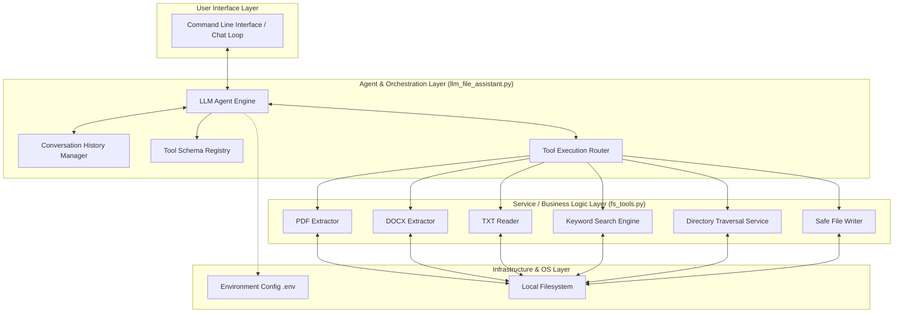
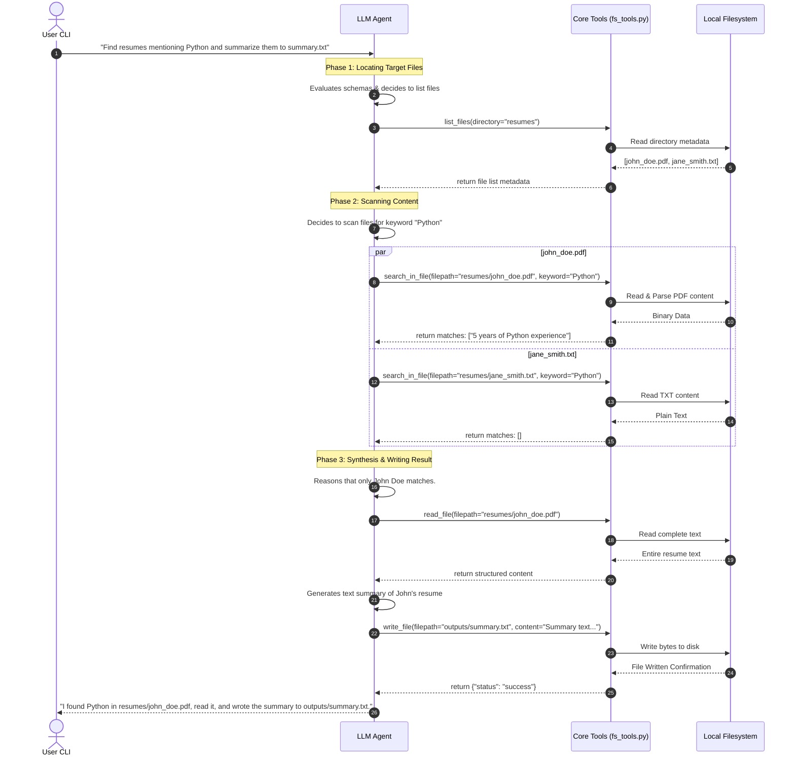

# LLM-Powered File System Assistant: System Architecture

This document provides a comprehensive overview of the design, architectural layers, data flows, and technical specifications for the **LLM-Powered File System Assistant**.

---

## 🏛️ Architectural Overview

The application follows a modular, layered architecture designed to decouple the LLM intelligence engine from the underlying operating system and file system utilities.



---

## 🛡️ Layer Breakdown

### 1. User Interface Layer
* **Component**: CLI / Interactive Shell Loop.
* **Responsibilities**:
  * Capture natural language user inputs from the console.
  * Print stream-like responses or structured terminal outputs from the agent.
  * Manage active shell state (e.g., exit commands, system settings).

### 2. Agent & Orchestration Layer (`llm_file_assistant.py`)
This layer represents the brain of the application. It translates raw user goals into orchestrated tool execution pathways.

* **LLM Agent Engine**: Interacts with the LLM API (e.g., OpenAI `gpt-4o`, Anthropic `claude-3-5-sonnet`, or Gemini `gemini-1.5-pro`). It utilizes a system prompt that specifies its role, constraints, and execution boundaries.
* **Conversation History Manager**: Maintains a list of message objects (`system`, `user`, `assistant`, and `tool`) in-memory to preserve conversation context.
* **Tool Schema Registry**: Holds declarations of our Python functions formatted in the LLM's expected tool-declaration schema (JSON Schema).
* **Tool Execution Router (ReAct Loop)**: 
  1. Sends user input and tool definitions to the LLM.
  2. Parses the LLM's response. If a `tool_call` is requested, it halts generation, extracts the tool name and arguments, and forwards them to the **Service Layer**.
  3. Receives the execution result, wraps it in a `tool` role message, and sends it back to the LLM to continue reasoning.
* **File Naming & Versioning Strategy**: The LLM engine must adhere to a strict naming pattern when creating output files (such as summaries or processed results) to ensure traceability and prevent accidental data loss:
  * **Initial Output**: The output filename must be identical to the source filename with `_output` appended (e.g., for source `resume_john_doe.pdf`, the output should be named `resume_john_doe_output.txt`).
  * **Subsequent Revisions**: If the same changes/summaries are updated or expected in subsequent execution runs, the output filename must append a version suffix starting with `_output_v1`, followed by `_output_v2`, etc. (e.g., `resume_john_doe_output_v1.txt`).

### 3. Service & Business Logic Layer (`fs_tools.py`)
This layer implements deterministic file system utilities. It remains completely independent of the LLM and can be tested in isolation.

* **Document Parsers**:
  * **PDF Extractor**: Utilizes libraries such as `pypdf` or `pdfplumber` to extract text from multi-page PDFs.
  * **DOCX Extractor**: Utilizes `python-docx` to iterate through paragraphs and extract pure text content.
  * **TXT Reader**: Standard native Python file reader with fallback encoding handling (e.g., `utf-8` with fallback to `latin-1`).
* **Keyword Search Engine**: Performs streaming file searches using case-insensitive substring matching, compiling matching lines and their indices.
* **Directory Traversal**: Scans directory tree structures, filters files based on extension suffixes, and extracts file-system attributes (size, modifications).
* **Safe File Writer**: Writes payload contents to target locations while ensuring parent directory chains are safely instantiated (`pathlib.Path.mkdir(parents=True, exist_ok=True)`).

### 4. Infrastructure & OS Layer
* **Environment Configuration**: A `.env` file houses API credentials, target root folder configurations, and execution parameters safely using `python-dotenv`.
* **Local Filesystem**: The persistent hardware layer containing target resumes and generated summaries.

---

## 🔄 Core Data Flows

### A. Complex Orchestrated Query (Search & Summarize)
The sequence below demonstrates how the assistant handles a compound query: *"Find resumes mentioning Python, read them, and write a summary file."*



---

## 🛠️ Tool Schema Specifications (JSON Schemas)

When registering tools with the LLM, the functions in `fs_tools.py` are mapped to JSON schema contracts. Below is the specification for these tool definitions.

### 1. `read_file` Schema
```json
{
  "type": "function",
  "function": {
    "name": "read_file",
    "description": "Reads and extracts structured text and metadata from a local resume file (.pdf, .docx, .txt).",
    "parameters": {
      "type": "object",
      "properties": {
        "filepath": {
          "type": "string",
          "description": "The absolute or relative path to the resume file."
        }
      },
      "required": ["filepath"]
    }
  }
}
```

### 2. `list_files` Schema
```json
{
  "type": "function",
  "function": {
    "name": "list_files",
    "description": "Lists all available files within a directory, with optional extension filtering.",
    "parameters": {
      "type": "object",
      "properties": {
        "directory": {
          "type": "string",
          "description": "The path of the directory to scan."
        },
        "extension": {
          "type": "string",
          "description": "Optional file extension filter, including the leading dot (e.g., '.pdf', '.txt')."
        }
      },
      "required": ["directory"]
    }
  }
}
```

### 3. `write_file` Schema
```json
{
  "type": "function",
  "function": {
    "name": "write_file",
    "description": "Writes text content to a specified target file, creating directories dynamically if needed.",
    "parameters": {
      "type": "object",
      "properties": {
        "filepath": {
          "type": "string",
          "description": "The target path where content should be written."
        },
        "content": {
          "type": "string",
          "description": "The string payload to write into the file."
        }
      },
      "required": ["filepath", "content"]
    }
  }
}
```

### 4. `search_in_file` Schema
```json
{
  "type": "function",
  "function": {
    "name": "search_in_file",
    "description": "Performs a case-insensitive keyword search on a file's content and returns occurrences with context.",
    "parameters": {
      "type": "object",
      "properties": {
        "filepath": {
          "type": "string",
          "description": "The path to the target file."
        },
        "keyword": {
          "type": "string",
          "description": "The search term or keyword."
        }
      },
      "required": ["filepath", "keyword"]
    }
  }
}
```

---

## 🛡️ Exception Boundary & Error Handling Matrix

To prevent system crashes during file operations, a robust exception boundary is enforced at the service level (`fs_tools.py`). Tools must **never** raise raw exceptions up to the agent loop; instead, they catch exceptions and translate them into standard error payloads.

| Operation / Tool | Failure Scenario | Mitigation / Handling Strategy | Returned Error Payload (`dict`) |
| :--- | :--- | :--- | :--- |
| **`read_file`** | File not found | Catch `FileNotFoundError` | `{"status": "error", "error_code": "FILE_NOT_FOUND", "message": "File 'x' does not exist."}` |
| **`read_file`** | Corrupt PDF or Docx | Catch parsing exceptions (`PyPDF2.errors.DependencyError`, etc.) | `{"status": "error", "error_code": "PARSING_FAILED", "message": "Unable to decode file content."}` |
| **`read_file`** | Permission Denied | Catch `PermissionError` | `{"status": "error", "error_code": "PERMISSION_DENIED", "message": "Read access denied."}` |
| **`write_file`** | Disk full / Read-only filesystem | Catch OS/IO errors | `{"status": "error", "error_code": "IO_ERROR", "message": "Failed to write content to disk."}` |
| **`list_files`** | Target directory is not a directory | Catch `NotADirectoryError` or invalid path check | `{"status": "error", "error_code": "INVALID_DIRECTORY", "message": "Path is not a valid directory."}` |

---

## 🚀 Extensibility and Scale Design

The assistant is engineered to scale with minimum friction. The following architectural patterns facilitate seamless extensions:

### 1. Adding New Tools
To add a new tool (e.g., `delete_file` or `regex_search`):
1. **Implement Core Logic**: Add a standalone function inside `fs_tools.py` with standard type annotations.
2. **Define Schema**: Create a corresponding JSON schema in `llm_file_assistant.py`.
3. **Register Tool**: Add the schema to the LLM invocation setup and map the tool name to the function in the dispatch router map.

### 2. Transitioning to Vector Search (RAG)
For advanced semantic resumes processing (e.g., *"Find profiles with leadership potential"*):
* The modular structure of `fs_tools.py` allows developers to swap the deterministic keyword search engine with a hybrid system that indexes files into a local vector store (like `Chromadb` or `Faiss`) and queries it using text embeddings.
