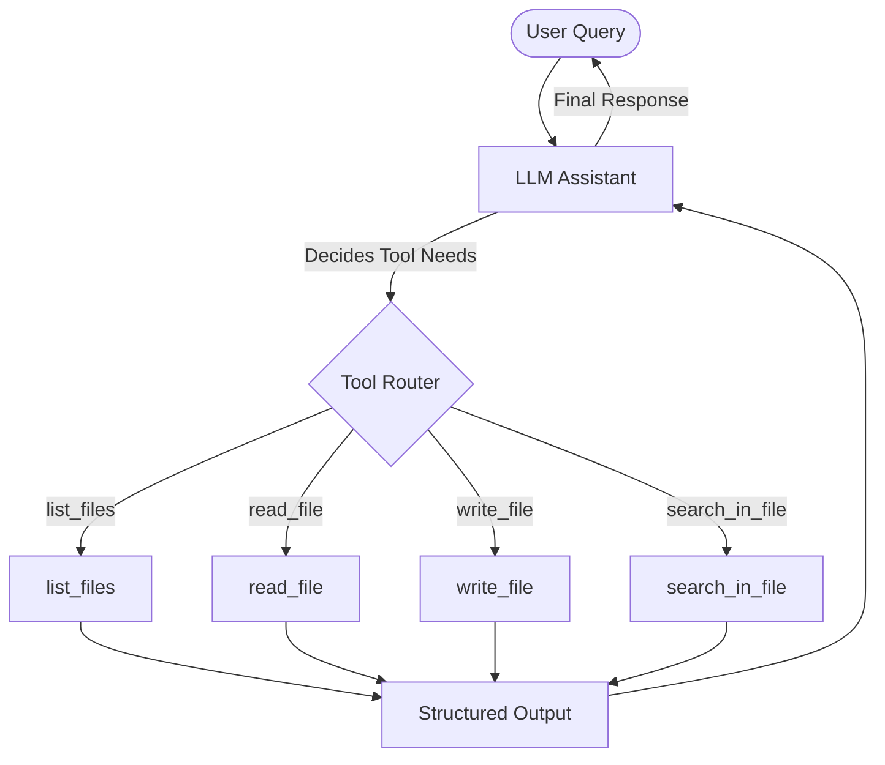

# LLM-Powered File System Assistant

## Project Overview
The **LLM-Powered File System Assistant** is a command-line utility and Python system designed to bridge the gap between Large Language Models (LLMs) and local file system operations. By implementing a set of core file-system tools and integrating them with an LLM using **Function Calling / Tool Use**, the assistant will be able to search, read, list, and write files dynamically based on natural language commands.

This project is structured as a two-part assignment:
1. **Part A: Core File System Tools (60%)** – Building robust, programmatic Python APIs for file operations and resume parsing.
2. **Part B: LLM Integration (40%)** – Connecting these APIs as executable tools to an LLM, enabling autonomous agent-like workflows.

---

## 🎯 Learning Objectives
By completing this project, you will:
* **Master LLM Function Calling & Tool Use**: Understand how to define structured interfaces that LLMs can understand and invoke dynamically.
* **Implement Structured API Contracts**: Design robust Python functions with clear input/output schemas (JSON/Dictionaries) and strict type annotations.
* **Handle Programmatic File I/O & Document Parsing**: Read, parse, and process raw text and binary document formats (PDF, DOCX, TXT) programmatically.
* **Build Resilient Systems**: Write bulletproof error-handling mechanisms that catch edge cases, permission errors, and missing files, returning structured error messages rather than crashing.

---

## 📋 Assignment Requirements

### 🗄️ Part A: Core File System Tools (60% weight)
You must implement a Python module named `fs_tools.py`. This module will serve as the engine of the assistant and must contain the following four functions with exact signatures and structured responses:

#### 1. `read_file(filepath: str) → dict`
> [!NOTE]
> This tool is responsible for ingestion and parsing of resume files.

* **Requirements**:
  * Read resume files in multiple formats: **PDF**, **TXT**, and **DOCX**.
  * Programmatically extract and clean the text content.
  * Parse out metadata if available (e.g., file type, character count).
  * Return a structured JSON-like dictionary containing the content and metadata.
  * Handle missing files or parsing errors gracefully by returning a structured error response.

* **Expected Output Format**:
  ```python
  {
      "status": "success",
      "filepath": "resumes/john_doe.pdf",
      "metadata": {
          "file_size_bytes": 10240,
          "file_type": "pdf",
          "character_count": 1500
      },
      "content": "Resume Content Extracted Here..."
  }
  ```

---

#### 2. `list_files(directory: str, extension: str = None) → list`
> [!NOTE]
> This tool lists files in a targeted directory with optional file-type filters.

* **Requirements**:
  * Traverse a specified directory.
  * Allow optional filtering of files by file extension (e.g., `.pdf`, `.txt`, `.docx`).
  * Return a list of dictionaries, where each dictionary contains detailed file metadata (name, path, size, modified date).

* **Expected Output Format**:
  ```python
  [
      {
          "filename": "john_doe.pdf",
          "filepath": "resumes/john_doe.pdf",
          "size_bytes": 10240,
          "modified_date": "2026-06-01T15:30:00Z"
      },
      {
          "filename": "jane_smith.txt",
          "filepath": "resumes/jane_smith.txt",
          "size_bytes": 4500,
          "modified_date": "2026-06-01T16:15:22Z"
      }
  ]
  ```

---

#### 3. `write_file(filepath: str, content: str) → dict`
> [!NOTE]
> This tool handles programmatic creation and writing of content.

* **Requirements**:
  * Write text content to the specified file path.
  * Dynamically create parent directories if they do not exist.
  * Return a success or failure status as a dictionary.

* **Expected Output Format**:
  ```python
  {
      "status": "success",
      "filepath": "summaries/john_doe_summary.txt",
      "message": "File written successfully."
  }
  ```

---

#### 4. `search_in_file(filepath: str, keyword: str) → dict`
> [!NOTE]
> This tool performs localized keyword searches inside files to locate relevant passages.

* **Requirements**:
  * Read the file and search for the specified keyword.
  * The search must be **case-insensitive**.
  * Return a list of matches along with their surrounding context (e.g., matching sentences or paragraph excerpts).

* **Expected Output Format**:
  ```python
  {
      "filepath": "resumes/john_doe.pdf",
      "keyword": "Python",
      "matches": [
          {
              "line_number": 12,
              "context": "...5+ years of experience building Python backend applications using Flask..."
          }
      ]
  }
  ```

---

### 🤖 Part B: LLM Integration (40% weight)
You must create an entrypoint script named `llm_file_assistant.py` that ties your tools to an LLM.



* **Requirements**:
  * Integrate the core Python tools with an LLM of your choice (e.g., **OpenAI GPT-4o / Anthropic Claude 3.5 Sonnet / Gemini 1.5 Pro**).
  * Configure the LLM to use **Tool Calling** (Function Calling), allowing the LLM to invoke your `fs_tools.py` APIs dynamically based on the conversation context.
  * Support complex, multi-step queries where the LLM must call one or more tools, synthesize the output, and answer the user.

#### 💡 Expected Behavior & Example Queries
The system should smoothly handle queries like:
* **"Read all resumes in the resumes folder"**
  * *Expected LLM path:* Calls `list_files(directory="resumes")`, then calls `read_file` sequentially for each file found.
* **"Find resumes mentioning Python experience"**
  * *Expected LLM path:* Calls `list_files`, then uses `search_in_file` (or `read_file` + LLM analysis) to identify Python profiles.
* **"Create a summary file for resume_john_doe.pdf"**
  * *Expected LLM path:* Calls `read_file("resumes/resume_john_doe.pdf")`, generates a professional summary, and calls `write_file` to save the summary to a new file.

---

## 📦 Deliverables
To successfully submit this assignment, you must prepare the following components:

| Deliverable | Description |
| :--- | :--- |
| **📁 Source Code** | A modular, well-documented implementation including `fs_tools.py` and `llm_file_assistant.py`. |
| **📄 `requirements.txt`** | Complete list of python package dependencies (e.g., `openai`, `pypdf`, `python-docx`, `python-dotenv`). |
| **📂 Sample Data** | A directory of **5-10 dummy resume files** in PDF, DOCX, and TXT formats to facilitate testing and validation. |
| **📖 `README.md`** | Comprehensive installation guide, configuration instructions (API keys), and command-line execution examples. |
| **🎥 Demo Video** | A **2-3 minute walk-through** showcasing the LLM successfully reasoning and invoking tools to solve user queries in real-time. |
